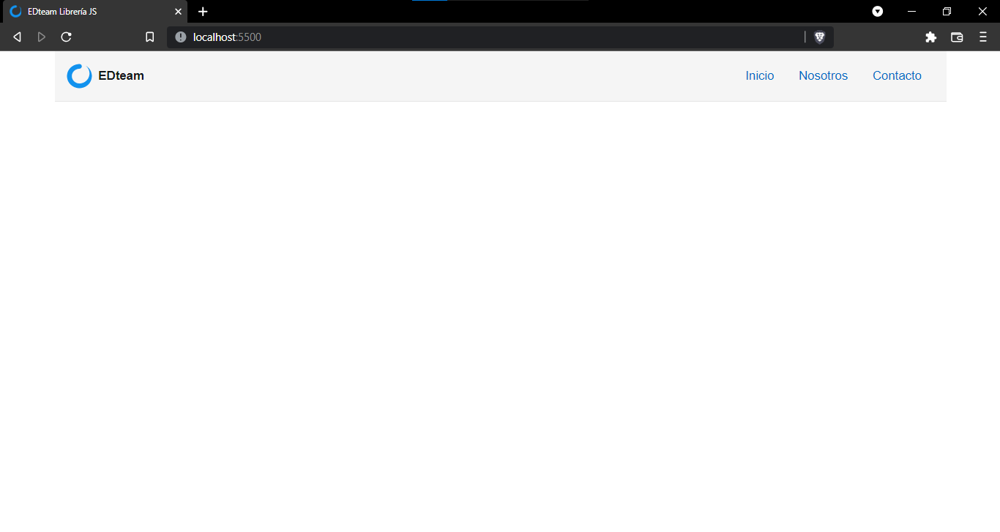

<!--
 Copyright (c) 2021 jodeperezlo

 This software is released under the MIT License.
 https://opensource.org/licenses/MIT
-->

```cmd
English
```

# Librería JS 📓

## [Curso React JS EDteam](https://app.ed.team/cursos/reactjs) 📚⚛️

In this repository, you will find the practice of module 1, of the [Curso de React JS](https://app.ed.team/cursos/reactjs),available in [EDteam](https://app.ed.team/).👨‍🏫

The purpose of module 1 is to understand what React JS is, how it works and how we can create a small custom library, with many shortcomings, but that works similar to the power of [React JS](https://reactjs.org/).⚛️

The intellectual author of this project is [EDteam](https://app.ed.team/); [Jorge de Jesus Perez Lopez](https://portfolio-jorgeperez.netlify.app/) added this repository so you can see the source code of this project and understand, learn, adding some extra features, forming a custom NavBar, that works as a navigation menu, using the little library that we created.

```cmd
Español
```

# Librería JS 📓

## [Curso React JS EDteam](https://app.ed.team/cursos/reactjs) 📚⚛️

En este repositorio, se encuentra la práctica del módulo 1, del [Curso de React JS](https://app.ed.team/cursos/reactjs), disponible en [EDteam](https://app.ed.team/).👨‍🏫

La finalidad del módulo 1 es comprender qué es React JS, cómo funciona y cómo podemos crear una pequeña librería personalizada, con muchas carencias, pero que funciona similar a la potencia de [React JS](https://reactjs.org/).⚛️

### Autor: Jorge de Jesús Pérez López 🧑‍💻

El autor intelectual de este proyecto es [EDteam](https://app.ed.team/); [Jorge de Jesús Pérez López](https://portfolio-jorgeperez.netlify.app/) agregó este repositorio para que puedas ver el código fuente de este proyecto y comprender, aprender, agregando algunas características extra, formando un NavBar personalizado, que funcione como un menú de navegación, utilizando la pequeña librería que creamos.

<br/>

# Final result:

<br/>


